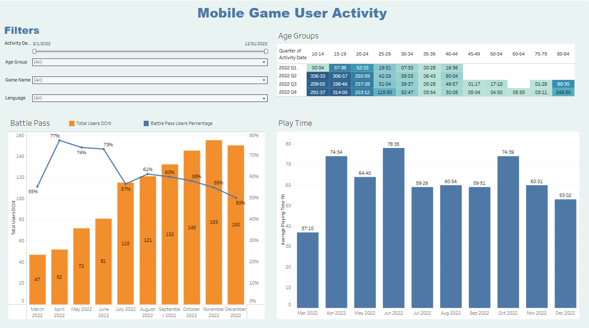

# 🎮 Mobile Game User Activity Dashboard

Interactive Tableau dashboard for analyzing player engagement, Battle Pass participation, average play time, and user activity patterns using a mobile game activity dataset.



---

## ❓ Business Questions

- How has player activity changed over time?
- What percentage of players engage with Battle Pass activities?
- Which age groups spend the most time in the game?
- How does average play time vary across different quarters?
- Which user segments show the highest engagement?

---

## 📌 Project Overview

This project analyzes player activity in a mobile game to understand user engagement and gameplay behavior over time.

The dashboard provides insights into:

- Monthly active users
- Battle Pass participation rate
- Average play time per unique player
- Activity distribution across age groups and quarters

Interactive filters allow exploration by activity date, age group, game activity, and device language.

---

## 📊 Dashboard Features

### 🎮 Battle Pass Metrics
- Total unique users by month
- Battle Pass participation percentage
- Dual-axis visualization combining bars and line chart

### ⏱️ Average Play Time
- Monthly average play time per unique player
- Time displayed in **HH:MM** format

### 🔥 Player Activity Heatmap
- Average play time by:
  - Age Group (5-year intervals)
  - Activity Quarter
- Color intensity highlights engagement levels

### 🎛️ Interactive Filters
- Activity Date
- Age Group
- Game Activity
- Device Language

---

## 🛠️ Technologies Used

- Tableau Public
- Calculated Fields
- Level of Detail (LOD) Expressions
- Table Calculations
- Dual-Axis Charts
- Heatmaps
- Interactive Dashboard Filters

---

## 📈 Key Metrics

- Monthly Active Users
- Battle Pass Participation Rate
- Average Play Time
- Player Activity by Age Group
- Quarterly Engagement Trends

---

## 📂 Repository Structure

```
Mobile-Game-User-Activity-Dashboard
│
├── dashboard/
│   └── Mobile Game User Activity.twbx
│
├── data/
│   └── games_activity_combined.csv
│
├── images/
│   └── Dashboard_1.png
│
└── README.md
```

---

## 🎯 Learning Objectives

This project demonstrates how to:

- Build interactive Tableau dashboards
- Create calculated fields
- Use LOD Expressions
- Design dual-axis visualizations
- Build heatmaps
- Format time values (HH:MM)
- Apply dashboard filters for user exploration

---

## 📷 Dashboard Preview


---

## 👨‍💻 Author

**Oleksandr Rudenko**

 Data Analyst

- SQL
- Tableau
- Power BI
- Python
- GitHub
